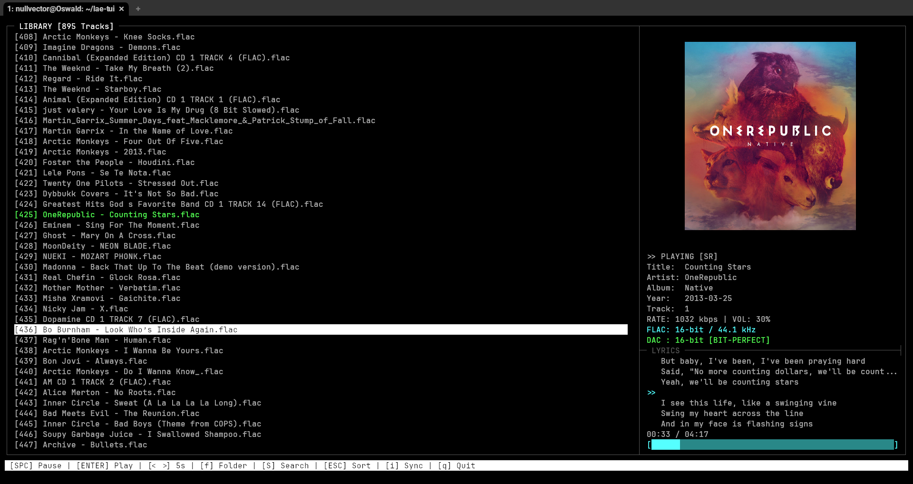
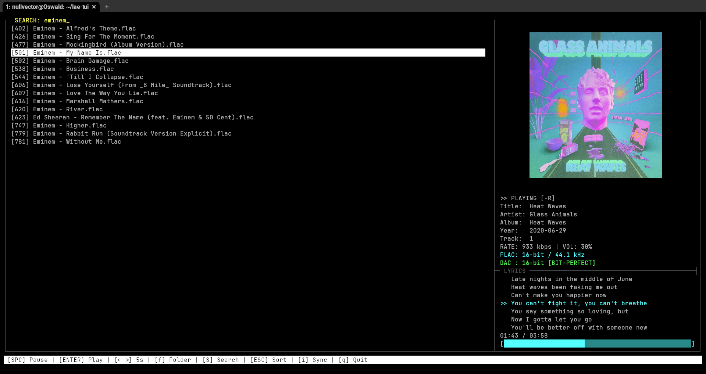
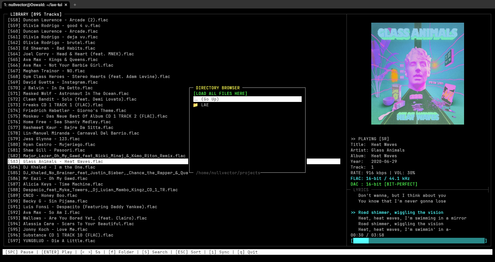
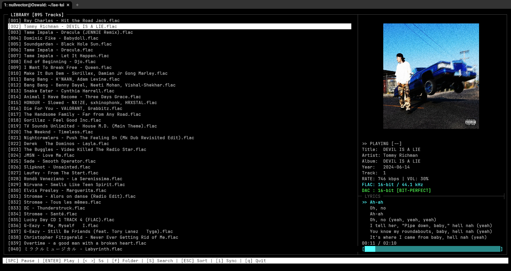
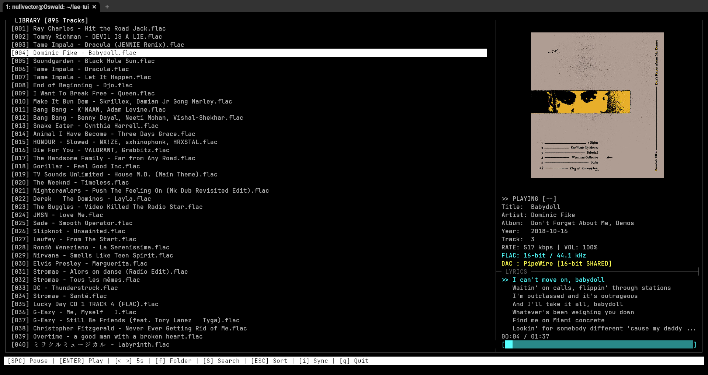

# LAE (Lossless Audio Engine) - TUI

## Previw

<p align="center">
  
  <br>
  <b>Main Interface: Bit-Perfect playback with live LRC syncing</b>
</p>

<p align="center">
  
  
</p>
<p align="center">
  
  
</p>

---

A highly optimized, bit-perfect Linux audio player built with a custom **C audio engine** and a **Rust-based** Terminal User Interface (TUI). 

LAE is designed for audiophiles and system administrators who want maximum hardware control and lossless audio fidelity without leaving the terminal.

## Architecture

This project utilizes a hybrid **Single-Loop Architecture** to maximize low-level hardware performance while maintaining a responsive, memory-safe user interface.

* **The Backend (C):** A custom-written audio engine that directly interfaces with the Linux ALSA subsystem. It handles decoding FLAC files, parsing Vorbis comments/metadata, extracting embedded album art, and managing the ring buffer.
* **The Frontend (Rust):** A 60-FPS synchronous terminal interface built with `crossterm`. It communicates with the C backend via a Foreign Function Interface (FFI) to read playback state and binary image data.

## The Audio Chain

LAE prioritizes audio fidelity by establishing a direct hardware connection, dynamically analyzing the target DAC's capabilities upon boot.

1.  **Bit-Perfect ALSA Mode:** If the hardware DAC supports the native bit-depth/sample rate of the source (e.g., 16-bit / 44.1kHz), the engine locks into a direct stream, bypassing software mixing.
2.  **ALSA Padded Mode:** If the hardware requires a different format (e.g., 32-bit target for a 16-bit file), the engine pads data losslessly to prevent sample distortion.
3.  **PipeWire Shared Mode:** Seamless fallback to default PipeWire/PulseAudio endpoints for standard desktop usage.

## Features

* **Bit-Perfect Hardware Playback:** True lossless streaming directly to ALSA devices.
* **Dynamic LRCLIB Integration:** Automatically fetches, caches, and live-syncs LRC lyrics.
* **Floating UI Overlays:** Interactive, layered menus for directory browsing and sorting.
* **In-Terminal Album Art:** Renders high-res art via GPU-accelerated protocols (WezTerm).
* **Zero-Dependency Playback:** Operates entirely locally once lyrics are cached.

> [!IMPORTANT]
> **Compatibility Note:** > * **GPU Rendering:** Album art rendering currently requires **WezTerm**. 
> * **Standard Terminals:** Runs perfectly on GNOME Terminal, Konsole, Alacritty, and Kitty, but album art will not be displayed.

---

## Keybindings

### Global Controls
| Key | Action |
| :--- | :--- |
| `Space` | Play / Pause |
| `Enter` | Play selected track |
| `→` | Seek forward 5 seconds |
| `←` | Seek backward 5 seconds |
| `↑ / ↓` | Navigate tracks |
| `+` / `-` | Volume Control |
| `q` | Quit application |

### Modes & Menus
| Key | Action |
| :--- | :--- |
| `f` | Open Directory Browser (Append folders) |
| `Shift + S` | Open Search Overlay |
| `Esc` | Open Sort Menu / Close overlay |
| `s` | Toggle Shuffle Mode |
| `r` | Toggle Repeat Mode |
| `i` | Toggle Auto-Sync Lyrics |

---

## Building from Source

### Dependencies
* **Ubuntu/Debian:** `sudo apt install build-essential libasound2-dev libflac-dev pkg-config`

### Compilation
```bash
git clone [https://github.com/Subhrajyotiguha/lae-tui.git](https://github.com/Subhrajyotiguha/lae-tui.git)
cd lae-tui
cargo build --release
./target/release/lae-tui
